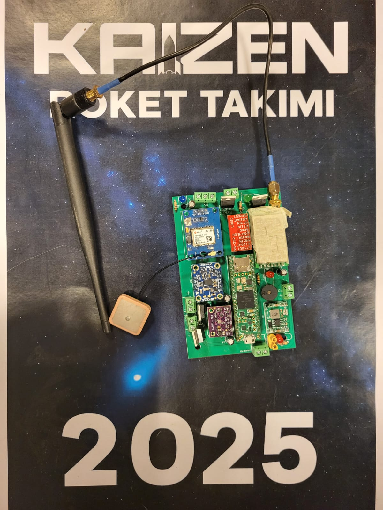

# Rocket Avionics System


A comprehensive avionics system developed for rocket flight, featuring real-time sensor integration, flight algorithms, and multiple communication protocols.

## Purpose & Mission

This avionics system is designed for **autonomous rocket control and recovery**. Its primary mission is to:

- **Launch Detection**: Automatically detect when the rocket leaves the ground
- **Flight Monitoring**: Track altitude, orientation, and acceleration in real-time
- **Apogee Detection**: Identify the rocket's highest point
- **Parachute Deployment**: Automatically trigger drogue and main parachutes at optimal altitudes
- **Safe Recovery**: Ensure the rocket returns safely to the ground

### Key Features:
- **Autonomous Operation**: No human intervention required during flight
- **Real-time Processing**: 100Hz sensor reading and decision making
- **Safety Systems**: Multiple safety mechanisms to prevent accidents
- **Competition Ready**: Compatible with rocket competition protocols
- **Long-range Communication**: LoRa telemetry for ground monitoring

## Table of Contents

- [Purpose & Mission](#purpose--mission)
- [System Overview](#system-overview)
- [Hardware Components](#hardware-components)
- [Firmware Components](#firmware-components)
- [Communication Protocols](#communication-protocols)
- [Flight Algorithms](#flight-algorithms)
- [Packet Structures](#packet-structures)
- [Installation](#installation)
- [Usage](#usage)
- [Project Structure](#project-structure)
- [Safety Notice](#safety-notice)
- [License](#license)

## System Overview

This project implements a complete rocket avionics system consisting of the following components:

- **Multi-Sensor Integration**: BMP388 (altitude/pressure), BNO055 (IMU), GPS, MPU6050
- **Real-time Flight Algorithms**: Launch detection, burnout detection, apogee detection
- **Autonomous Control**: Automatic parachute deployment based on flight conditions
- **Multiple Communication Modes**: LoRa telemetry, RS232 command interface
- **Test Modes**: SIT (System Integration Test) and SUT (System Under Test) modes
- **Payload System**: Dual MPU6050 sensors with RMS calculation, GPS tracking

## Flight Demonstration

<div align="center">
  
</div>

*Rocket flight test demonstration showing the avionics system in action.*

## Hardware Components

### Flight Computer Board

<div align="center">
  
</div>

*The flight computer features a Teensy 4.x microcontroller with integrated sensors and communication modules for autonomous rocket control. The board includes GPS6MUZ GPS module, BNO055 IMU sensor, BMP388 barometric pressure sensor, LoRa E22 telemetry module, and various control circuits for pyro channel management.*

### 1. Main Flight Computer (RoketAlgoritma.ino)
**Microcontroller**: Teensy 4.x
- **BMP388 Sensor**: Barometric pressure and altitude measurement
- **BNO055 IMU**: 9-DOF motion and orientation sensor
- **GPS Module**: Global positioning and navigation
- **LoRa E22 Module**: Long-range wireless communication
- **RS232 Interface**: High-speed serial communication
- **Pyro Control Circuits**: MOSFET-based parachute deployment

**Pin Configuration**:
```
I2C: SDA=17, SCL=16
LoRa: TX=0, RX=1
RS232: TX=9, RX=10
GPS: TX=14, RX=15
Pyro: CH1=23, CH2=38
```

### 2. Payload Rocket Code (gorevyukuroketkod.ino)

<div align="center">
  
</div>

**Microcontroller**: Teensy 4.1
- **GPS Module**: Position and altitude tracking
- **MPU6050 Sensors**: Internal and external acceleration sensors (I2C addresses: 0x68, 0x69)
- **LoRa E22 Module**: Telemetry transmission
- **SD Card**: Data logging
- **Kalman Filters**: Sensor data filtering

### 3. Receiver Systems
- **GorevYukuNanoAlici.ino**: Arduino Nano-based payload receiver
- **RoketNanoAlici.ino**: Arduino Nano-based rocket receiver
- **RoketUnoAlici.ino**: Arduino Uno-based rocket receiver

## Firmware Components

### 1. Main Flight Computer (RoketAlgoritma.ino)
**Features**:
- Real-time sensor reading (100Hz)
- Data improvement with Kalman filtering
- Autonomous flight algorithms
- SIT/SUT test modes
- RS232 command interface

**Main Functions**:
- `readSensors()`: Reads all sensor data
- `flightAlgo()`: Executes flight control algorithms
- `sendLoRa()`: Transmits telemetry via LoRa
- `sendSitTelemetry()`: Sends SIT test data
- `receiveSutPacket()`: Processes SUT test data

### 2. Payload Rocket Code (gorevyukuroketkod.ino)
**Features**:
- GPS position tracking
- Dual MPU6050 sensor support
- RMS (Root Mean Square) calculation
- Kalman filtering
- SD card data logging
- LoRa telemetry

**Main Functions**:
- `readMPU6050Data()`: Reads MPU6050 data
- `calculateRMS()`: Calculates RMS values
- `sendLoRaData()`: Sends LoRa telemetry
- `writeDataToSD()`: Writes data to SD card

### 3. Receiver Systems
**GorevYukuNanoAlici.ino**:
- Data reception via LoRa E22
- JSON format output to computer
- 21 byte packet structure

**RoketNanoAlici.ino & RoketUnoAlici.ino**:
- 46 byte telemetry packet reception
- JSON format output
- Header control and data validation

## Communication Protocols

### 1. LoRa E22 Telemetry
**Main Flight Computer → Receivers**
- **Packet Size**: 46 bytes
  - **Frequency**: 866MHz (configurable)
- **Range**: 15km (tested)
- **Transmission Rate**: 300ms (3.33 Hz)

**Packet Structure**:
```
Byte 0:   Header (0x67)
    Bytes 1-4:   Altitude (float, 4 bytes)
    Bytes 5-8:   GPS Altitude (float, 4 bytes)
    Bytes 9-12:  GPS Latitude (float, 4 bytes)
    Bytes 13-16: GPS Longitude (float, 4 bytes)
    Bytes 17-20: Gyroscope X (float, 4 bytes)
    Bytes 21-24: Gyroscope Z (float, 4 bytes)
    Bytes 25-28: Gyroscope Y (float, 4 bytes)
    Bytes 29-32: Pitch (float, 4 bytes)
    Bytes 33-36: Acceleration X (float, 4 bytes)
    Bytes 37-40: Acceleration Z (float, 4 bytes)
    Bytes 41-44: Acceleration Y (float, 4 bytes)
    Byte 45:     State (8-bit flags)
```

### 2. Payload LoRa Telemetry
**Payload → Receiver**
- **Packet Size**: 21 bytes
- **Header**: 0x52
- **Transmission Rate**: 165ms (6 Hz)

**Packet Structure**:
```
Byte 0:   Header (0x52)
Bytes 1-4:   GPS Latitude (float, 4 bytes)
Bytes 5-8:   GPS Longitude (float, 4 bytes)
Bytes 9-12:  GPS Altitude (float, 4 bytes)
Bytes 13-16: RMS Internal Sensor (float, 4 bytes)
Bytes 17-20: RMS External Sensor (float, 4 bytes)
```

**Detailed Byte Layout**:
```
Byte 0:   Header (0x52)
Bytes 1-4:   GPS Latitude (float, Little Endian)
Bytes 5-8:   GPS Longitude (float, Little Endian)
Bytes 9-12:  GPS Altitude (float, Little Endian)
Bytes 13-16: RMS Internal Sensor (float, Little Endian)
Bytes 17-20: RMS External Sensor (float, Little Endian)
```

### 3. RS232 Command Protocol
**Ground Station → Main Flight Computer**
- **Baud Rate**: 115200
- **Packet Size**: 5 bytes

**Command Packet Structure**:
```
Byte 0: Header (0xAA)
Byte 1: Command
Byte 2: Reserved
Byte 3: Footer1 (0x0D)
Byte 4: Footer2 (0x0A)
```

**Commands**:
```
- `0x20`: Start SIT mode
- `0x22`: Start SUT mode
- `0x24`: Stop mode (return to Normal mode)
```
### 4. SIT/SUT Test Protocols

**SIT (System Integration Test)**:
- Sends raw sensor data via RS232
- 36 byte packet structure
- Big Endian format
- Checksum verification

**SUT (System Under Test)**:
- Receives data from external source
- Tests flight algorithms
- Sends 10 Hz status packets
- 6 byte status packet structure

## Flight Algorithms

### Kalman Filter Implementation

The system implements Kalman filters for sensor data processing to improve accuracy and reduce noise:

#### **Barometric Altitude Filtering**
```cpp
// Barometric altitude Kalman filter
SimpleKalmanFilter baroKalman(1, 1, 0.01);
float kalmanAlt = baroKalman.updateEstimate(rawAlt);
```

**Parameters**:
- **Measurement Error**: 1.0m (sensor noise)
- **Estimation Error**: 1.0m (prediction uncertainty)
- **Process Noise**: 0.01m (system dynamics)

#### **Angle Data Filtering**
```cpp
// Angle data Kalman filter
SimpleKalmanFilter angleKalman(2, 2, 0.1);
float kalmanPitch = angleKalman.updateEstimate(absPitch);
```

**Parameters**:
- **Measurement Error**: 2.0° (sensor noise)
- **Estimation Error**: 2.0° (prediction uncertainty)
- **Process Noise**: 0.1° (system dynamics)

#### **Filter Benefits**
- **Noise Reduction**: Eliminates sensor measurement noise
- **Smooth Data**: Provides stable, filtered sensor readings
- **Real-time Processing**: Low computational overhead
- **Adaptive**: Automatically adjusts based on sensor confidence

### 1. Launch Detection
```cpp
// Minimum altitude gain from ground level
if (!launch && altGain > 5.0f && altGain < 100.0f) {
    launch = true;
}
```

**Parameters**:
- Minimum altitude gain: 5.0m
- Maximum altitude gain: 100.0m
- Valid altitude maximum: 10000.0m

### 2. Burnout Detection
```cpp
// Motor burnout detection via acceleration decrease
float totalAccel = sqrt(accX² + accY² + accZ²);
if (totalAccel < maxAccelTotal * 0.7f && totalAccel < 3.0f) {
    burnout = true;
}
```

**Parameters**:
- Normal mode: 80% decrease, 2.0 m/s² threshold
- SUT mode: 70% decrease, 3.0 m/s² threshold
- Confirmation time: 100-200ms

### 3. Angle Threshold Detection
```cpp
// Pitch angle threshold control
if (absAngle > 20.0f && (millis() - angleT) >= 50) {
    angleFlag = true;
}
```

**Parameters**:
- Angle threshold: 20.0°
- Hold time: 50ms
- Check interval: 50ms

### 4. Descent Detection
```cpp
// Altitude drop from maximum altitude
if ((maxAlt - fAlt) >= 10.0f) {
    desc = true;
}
```

**Parameters**:
- Drop threshold: 10.0m
- Minimum altitude: 20.0m

### 5. Parachute Control

**Drogue Parachute**:
```cpp
// Descent + angle threshold + altitude control
if (!sep1 && desc && angleFlag && fAlt > 100.0f) {
    digitalWrite(PYRO1_PIN, HIGH);
    sep1 = true;
}
```

**Main Parachute**:
```cpp
// Altitude range control
if (!sep2 && desc && fAlt <= 600.0f && fAlt >= 400.0f) {
    digitalWrite(PYRO2_PIN, HIGH);
    sep2 = true;
}
```

**Parameters**:
- Drogue minimum altitude: 100.0m
- Main parachute range: 400-600m
- Pyro pulse duration: 500-2000ms

## Packet Structures

### 1. Main Telemetry Packet (46 bytes)
```cpp
struct TelePkt {
    uint8_t hdr;      // 0x67
    uint8_t body[44]; // 11 float * 4 bytes
    uint8_t state;    // Status flags
};
```

### 2. Payload Packet (21 bytes)
```cpp
struct DataPacket {
    uint8_t header;   // 0x52
    uint8_t body[20]; // 5 float * 4 bytes
};
```

### 3. SIT Test Packet (36 bytes)
```cpp
// Big Endian format
Byte 0: Header (0xAB)
Bytes 1-4: Altitude
Bytes 5-8: Pressure
Bytes 9-12: Acceleration X
Bytes 13-16: Acceleration Y
Bytes 17-20: Acceleration Z
Bytes 21-24: Angle X
Bytes 25-28: Angle Y
Bytes 29-32: Angle Z
Byte 33: Checksum
Byte 34: Footer1 (0x0D)
Byte 35: Footer2 (0x0A)
```

### 4. SUT Status Packet (6 bytes)
```cpp
Byte 0: Header (0xAA)
Byte 1: Data1 (low byte)
Byte 2: Data2 (high byte)
Byte 3: Checksum
Byte 4: Footer1 (0x0D)
Byte 5: Footer2 (0x0A)
```

### 5. Status Bits (8-bit)
```
Bit 0: Rocket launch detected
Bit 1: Motor burnout prevention period
Bit 2: Minimum altitude threshold exceeded
Bit 3: Rocket body angle excessive
Bit 4: Rocket altitude started descending
Bit 5: Drogue parachute command
Bit 6: Altitude below determined level
Bit 7: Main parachute command
```

## Installation

### 1. Requirements
- **Arduino IDE** 1.8.x or later
- **Teensyduino** (for Teensy usage)
- **Required Libraries**:
  - Adafruit_Sensor
  - Adafruit_BMP3XX
  - Adafruit_BNO055
  - TinyGPS++
  - LoRa_E22
  - SimpleKalmanFilter

### 2. Hardware Connections
```
Teensy 4.x Main Flight Computer:
├── I2C: SDA=17, SCL=16 (BMP388, BNO055)
├── LoRa: TX=0, RX=1 (E22)
├── RS232: TX=9, RX=10 (Ground Station)
├── GPS: TX=14, RX=15 (GPS Module)
└── Pyro: CH1=23, CH2=38 (Parachute Triggering)

Teensy 4.1 Payload:
├── GPS: RX=7, TX=8
├── LoRa: RX=21, TX=20
├── I2C: Wire2 (MPU6050 x2)
└── SD: BUILTIN_SDCARD

Arduino Nano/Uno Receivers:
├── LoRa: RX=8, TX=9 (Nano)
├── LoRa: RX=8, TX=9 (Uno)
└── USB: Serial monitor output
```

### 3. Firmware Upload
1. Open Arduino IDE
2. Install required libraries
3. Open the relevant .ino file
4. Select the correct board (Teensy 4.x, Arduino Nano/Uno)
5. Upload

## Usage

### 1. Main Flight Computer
1. **Power On**: Wait for sensor calibration
2. **Pre-flight Check**: Verify all sensors are reading correctly
3. **Launch**: System automatically detects launch and begins flight algorithms
4. **Recovery**: Automatic parachute deployment based on flight conditions

### 2. Test Modes
- **Normal Mode**: Standard flight operation
- **SIT Mode**: System Integration Test - sends fixed test data
- **SUT Mode**: System Under Test - receives external data and tests

### 3. Command Sending (RS232)
```cpp
// Start SIT mode
0xAA 0x20 0x00 0x0D 0x0A

// Start SUT mode
0xAA 0x22 0x00 0x0D 0x0A

// Stop mode
0xAA 0x24 0x00 0x0D 0x0A
```

## Project Structure

```
RocketAvionicsSystem/
├── README.md                           # This file
├── LICENSE                             # License information
├── images/                             # Project images
│   └── board.jpeg                      # Flight computer board
├── firmware/                           # Firmware codes
│   ├── RoketAlgoritma/                 # Main flight computer
│   │   └── RoketAlgoritma.ino
│   ├── gorevyukuroketkod/              # Payload rocket code
│   │   └── gorevyukuroketkod.ino
│   ├── GorevYukuNanoAlici/             # Payload receiver
│   │   └── GorevYukuNanoAlici.ino
│   ├── RoketNanoAlici/                 # Rocket receiver (Nano)
│   │   └── RoketNanoAlici.ino
│   └── RoketUnoAlici/                  # Rocket receiver (Uno)
│       └── RoketUnoAlici.ino
```

## Safety Notice

⚠️ **IMPORTANT SAFETY WARNING**

- This system controls pyrotechnic devices
- Always follow proper safety procedures
- Test thoroughly in safe conditions
- Ensure proper safety measures are in place
- Comply with local regulations
- Pyro pins must be in LOW position initially
- Do not connect pyro devices during testing
- It is not the final code of the rocket.

## License

This project is licensed under the MIT License - see the [LICENSE](LICENSE) file for details.

## Support

For questions and support:
- Create an issue on GitHub
- Review project documentation
- Follow safety procedures
- **Contact**: yunusemrekonya6@gmail.com


---

**Version**: 2.0.0  
**Last Updated**: December 2025  
**Developer**: Yunus Emre Çiftçi - Yüksel Yurtbahar


## Rockstar - Kaizen

<div align="center">
  
</div>
